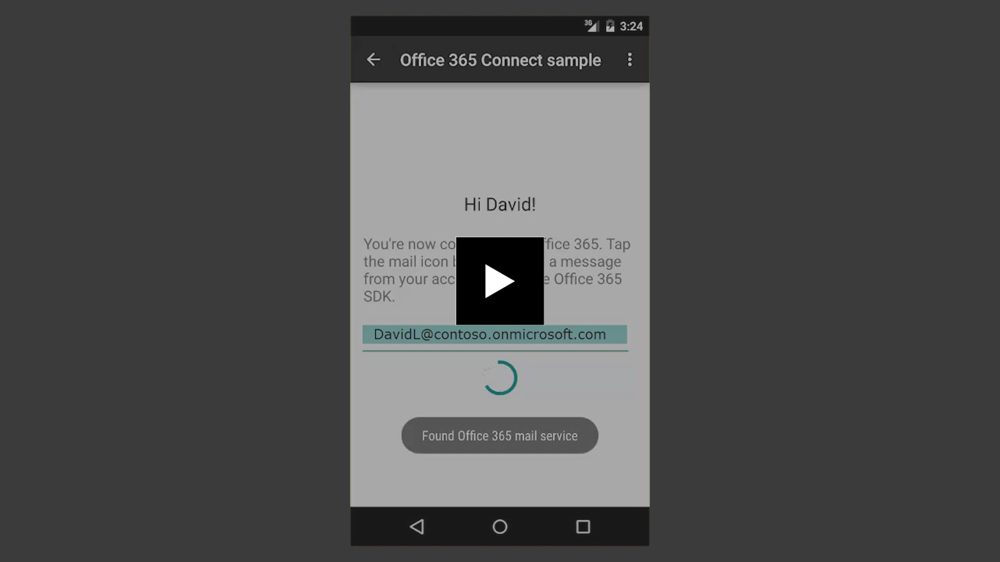
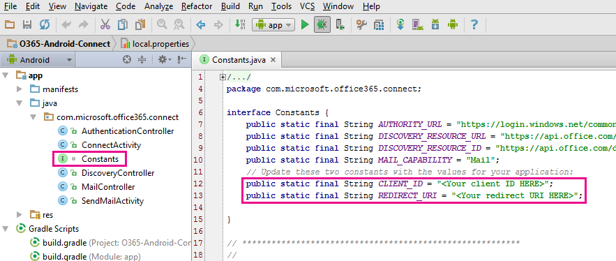

# Android 用 Office 365 Connect のサンプル

Office 365 への接続は、各 Android アプリが Office 365 のサービスおよびデータの操作を開始するために必要な最初の手順です。このサンプルは、1 つの API に接続してから呼び出す方法を示しています。

## デバイスの要件

Connect のサンプルを実行するには、デバイスが次の要件を満たしている必要があります。

* 画面のサイズが 800 x 480 以上である。
* Android の API レベルが 15 以上である。
 
## 前提条件

Android 用 Office 365 Connect のサンプルを使用するには以下が必要です。

* [Android Studio](http://developer.android.com/sdk/index.html) バージョン 1.0 以上。
* Office 365 アカウント。Office 365 アプリのビルドを開始するために必要なリソースを含む [Office 365 Developer サブスクリプション](http://aka.ms/o365-android-connect-signup) にサイン アップできます。
* Azure に登録されたアプリケーションのクライアント ID とリダイレクト URI の値。アプリケーションは、**ユーザーとしてメールを送信する**アクセス許可で実行する必要があります。

また、[Azure にネイティブ クライアント アプリケーションを追加](http://aka.ms/o365-android-connect-addapp)し、[適切なアクセス許可を付与](https://github.com/OfficeDev/O365-Android-Connect/wiki/Grant-permissions-to-the-Connect-application-in-Azure)することもできます。

## Android Studio を使用してサンプルを開く

1. developer.android.com の[指示](http://developer.android.com/sdk/installing/adding-packages.html)に従って、[Android Studio](http://developer.android.com/tools/studio/index.html#install-updates) をインストールし、Android SDK パッケージを追加します。
2. このサンプルをダウンロードするか、クローンを作成します。
3. Android Studio を起動します。
	1. **[既存の Android Studio プロジェクトを開く]** を選択します。
	2. ローカル リポジトリを参照し、O365-Android-Connect プロジェクトを選択します。**[OK]** をクリックします。
4. Constants.java ファイルを開きます。
	1. CLIENT\_ID 定数を検索して、その String 値を Azure Active Directory に登録されているクライアント ID と同じ値に設定します。
	2. REDIRECT\_URI 定数を検索して、その String 値を Azure Active Directory に登録されているリダイレクト URI と同じ値に設定します。
    

    > 注:CLIENT\_ID と REDIRECT\_URI の値がない場合は、[ネイティブ クライアント アプリケーションを Azure に追加](https://msdn.microsoft.com/library/azure/dn132599.aspx#BKMK_Adding)し、CLIENT\_ID と REDIRECT_URI を書き留めます。

Connect のサンプルをビルドしたら、エミュレーターまたはデバイス上で実行できます。

サンプルの詳細について確認する場合は、Wiki ページ「[コードを理解する](https://github.com/OfficeDev/O365-Android-Connect/wiki/Understanding-the-Connect-sample-code)」にアクセスしてください。

## 質問とコメント

この Android 用 Connect サンプルについて、Microsoft にフィードバックをお寄せください。質問やご提案を送信する方法は次のとおりです。

* このリポジトリの「[問題](https://github.com/OfficeDev/O365-Android-Connect/issues)」セクション。
* [docthis@microsoft.com](mailto:docthis@microsoft.com?subject=Feedback%20on%20the%20Office%20365%20Connect%20sample%20for%20Android) への電子メールの送信。

## 次の手順

このサンプルでは、アプリが Office 365 を使用して操作する必要がある重要項目のみを示しています。アプリが Office 365 API を使用してできることがさらに多数あります。たとえば、ユーザーが予定表で作業日を管理できるようにする、ユーザーが OneDrive に保存したすべてのファイルで必要な情報を検索する、または連絡先のリストからユーザーが必要とする人を正確に見つけるなどです。「[Office 365 API スタート プロジェクト (Android 用)](https://github.com/officedev/O365-Android-Start/)」でさらに説明しています。お客様のアイデアを刺激するお役に立つことができればと思います。 
  
## その他の技術情報

* [Office 365 API ドキュメント](http://aka.ms/o365-android-connect-platformoverview)
* [Office 365 SDK for Android](http://aka.ms/o365-android-connect-sdk)
* [Android 用 Office デベロッパー センター](http://aka.ms/o365-android-connect-getstarted)
* [Office 365 API スタート プロジェクトおよびサンプル コード](http://aka.ms/o365-android-connect-codesamples)

## 著作権
Copyright (c) 2015 Microsoft.All rights reserved.

